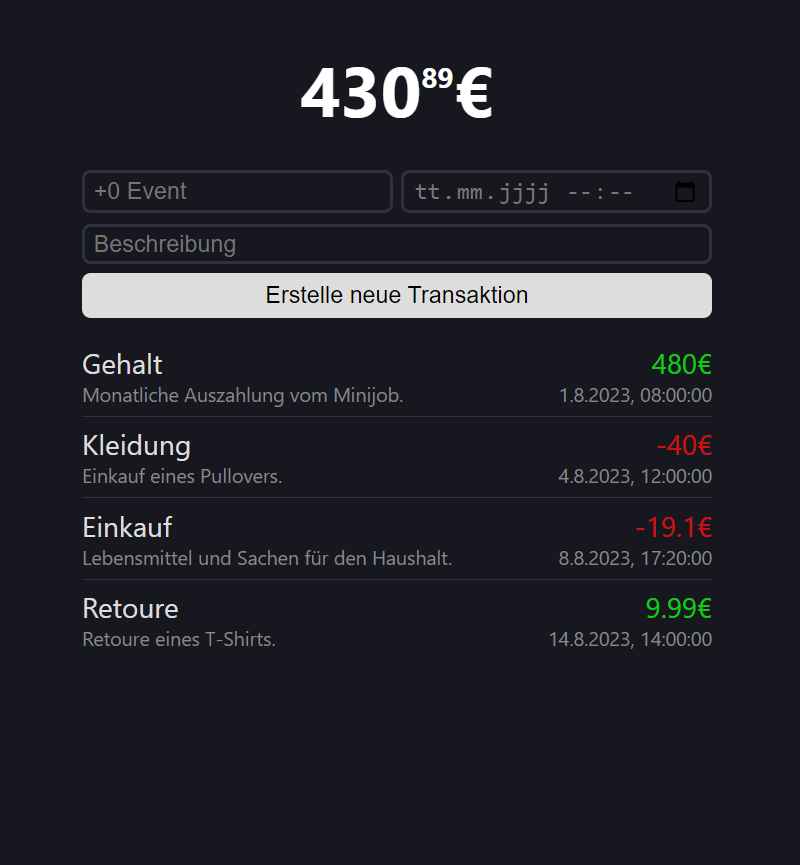

# money-tracker
An application to track income and expenses.

### Application Information
* Built using the MERN stack: `MongoDB`, `Express`, `React` and `Node.js`.
* Its purpose is for budget planing.
* It is a simple and minimalistic program.
* The UI is written in german.

<h3 align="left">Used programming languages</h3>

### Preview

